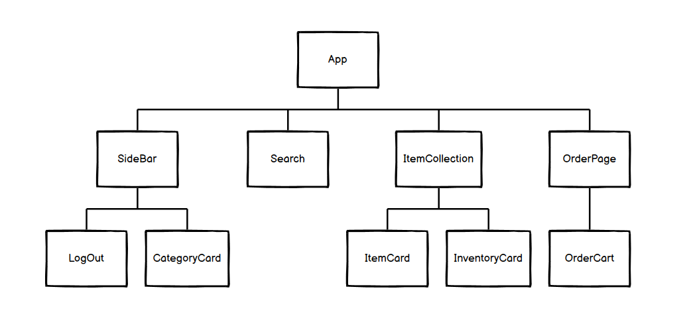
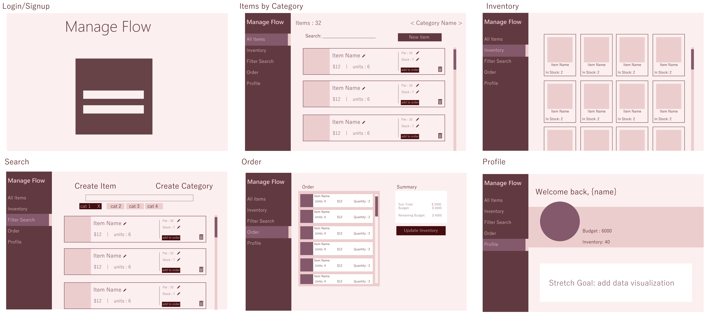
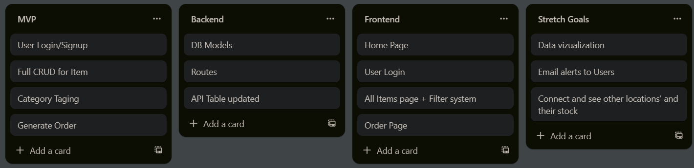

# Manage Flow
Manage Flow is designed specifically with managers in mind who want to efficiently track their stock levels and effortlessly create orders based on optimal par quantities.

## Features ✨
Users will be able to
- Sign up/Log in to create an inventory of items.
- Users can sort items into catagories. 
- Provide up-to-date information on inventory levels. Set par levels for each item in your inventory, ensuring that you never run out of critical items or overstock unnecessarily
- When items reach their par levels, the app will automatically generate optimized purchase orders
- Get valuable insights, identify high-demand items, track slow-moving stock, and optimize your inventory strategy with comprehensive reports

// Stretch Goals 🏆
- Receive alerts when stock becomes low and when order dates come up
- Email alerts to Users
- Connect and see other locations' and their stock

## Database Schema 📝

### Database Relationships

__1 to many relationships:__
- 1 User can have many Orders
- 1 User can have many Items
- 1 User can have many Stocks

__1 to 1 relationships__
- 1 Item can only have 1 Stock and 1 Stock only belongs to 1 Item
- 1 Order can only have 1 Order_Details
- 1 User can only have 1 Budget

__Many to many relationships__
- One Order can have many Items and one Item can be apart of many Orders.
- One Category can have many Items and one Item can be apart of many Categories.

## API Routes
| API Route  	| Request Method 	| Body                                                            	| Response                                                            	|
|------------	|-------------------	|-----------------------------------------------------------------	|---------------------------------------------------------------------	|
| /items     	| GET               	|                                                                   | [{ id, name, price, par_level, user_id, created_at, updated_at }]     |
| /items/:id    | GET               	|                                                               	| { id, name, price, par_level, user_id, created_at, updated_at }       |
| /budgets     	| GET               	|                                                                   | [{ id, name, price, par_level, user_id, created_at, updated_at }]     |
| /stocks     	| GET               	|                                                                   | [{ id, item_id, user_id, quantity, created_at, updated_at }]       	|
| /stocks/:id   | GET               	|                                                               	| { id, item_id, user_id, quantity, created_at, updated_at}             |
| /category_tags| GET               	|                                                                   | [{ id, item_id, category_id }]                                        |
| /orders/:id   | GET               	|                                                               	| { id, item_id, order_id, quantity, created_at, updated_at }       |
| /items     	| POST              	| { name, price, par_level, user_id }                       	    | { id, name, price, par_level, user_id, created_at, updated_at }    	|
| /budgets     	| POST              	| { budget, user_id }                                          	    | { id, budget, user_id, created_at, updated_at }                    	|
| /stocks     	| POST              	| { item_id, user_id, quantity }                               	    | { id, item_id, user_id, quantity, created_at, updated_at }    	    |
| /login     	| POST               	| { username, password}                                             | { id, name, username, password, email }                               |
| /category     | POST              	| { item_id, category_id }                                     	    | { id, item_id, category_id }                                      	|
| /orders     	| POST              	| { item_id, order_id, quantity }                              	    | { id, item_id, order_id, quantity }    	|
| /items/:id    | PATCH              	| {[...]}                                                   	    | { id, name, price, par_level, user_id, created_at, updated_at }    	|
| /budgets/:id  | PATCH              	| {[...]}                                                   	    | { id, budget, user_id, created_at, updated_at }                   	|
| /stocks/:id   | PATCH              	| {[...]}                                                   	    | { id, budget, user_id, quantity, created_at, updated_at }          	|
| /orders/:id   | PATCH              	| {[...]}                                                   	    | { id, item_id, order_id, quantity, created_at, updated_at }    	|
| /items/:id    | DELETE              	|                                                              	    | { }                                                                	|
| /logout     	| DELETE              	|                                                              	    | { }                                                                	|
| /category_tags/:id| DELETE              	|                                                              	    | { }                                                                	|

## Component Hierarchy  

## WireFrame 

## Kanban Board
